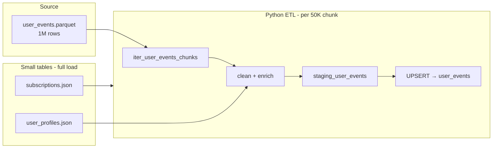

# Processing 1 Million Rows

This document explains how this pipeline handles **1M user events** and the design choices behind it. Use it for interviews, onboarding, or debugging scale issues.

## The problem

A naive ETL pipeline breaks at ~1M rows because it:

1. Loads the entire source file into RAM (`json.load` on a 1M-record JSON file can exceed 1–2 GB)
2. Transforms everything in one giant pandas DataFrame
3. Checks duplicates by `SELECT primary_key FROM table` into pandas (does not scale)
4. Inserts row-by-row or in tiny batches

Our pipeline avoids all four.

## The solution (four layers)

```
┌─────────────────────────────────────────────────────────────────────────┐
│  1. GENERATE   Parquet + chunked writes (50K rows at a time)            │
│  2. EXTRACT    iter_user_events_chunks() — never load full file        │
│  3. TRANSFORM  clean + enrich per chunk (~50K rows in memory)         │
│  4. LOAD       staging table → PostgreSQL UPSERT per chunk              │
└─────────────────────────────────────────────────────────────────────────┘
```

### 1. Parquet instead of JSON (source format)

| Format | 1M events (approx.) | Read pattern |
|--------|---------------------|--------------|
| JSON   | ~400–800 MB         | Must parse entire file |
| Parquet| ~50–120 MB (snappy) | Read row groups in chunks |

`scripts/generate_data.py` writes `user_events.parquet` when `--events >= 100,000`. Small dev runs use `--small` (10K JSON).

### 2. Chunked extract (memory flat)

`src/extract/extractors.py` exposes `iter_user_events_chunks()`:

- **Parquet**: `pyarrow.parquet.ParquetFile.iter_batches(batch_size=50_000)`
- **JSON**: fallback for small files; still chunked after load

`src/main.py` never calls `extract_user_events()` for the full dataset during production runs. It loops chunks instead.

### 3. Chunked transform

Each chunk is independently:

- `clean_user_events()` — dedupe, type coercion, JSON serialization
- `enrich_user_events()` — left join to user profiles (profiles are ~500–1,000 rows, cheap)

Peak memory ≈ one chunk (~50K rows) + profiles, not 1M rows.

### 4. Staging + UPSERT (load without reading the warehouse)

`src/load/loaders.py` → `load_user_events()`:

```sql
TRUNCATE staging_user_events;
-- bulk insert chunk into staging (chunksize=1000)
INSERT INTO user_events (...)
SELECT ... FROM staging_user_events
ON CONFLICT (event_id) DO UPDATE SET ...;
TRUNCATE staging_user_events;
```

**Why this scales:**

- PostgreSQL does deduplication via `ON CONFLICT` — no `SELECT event_id FROM user_events` into pandas
- Bulk insert uses `method='multi'` with `chunksize=1000`
- Idempotent: re-running the pipeline updates existing events instead of failing on duplicates
- Each 50K chunk repeats this cycle; total rows accumulate in `user_events`

This is the same pattern used in Snowflake (MERGE), BigQuery (MERGE), and Redshift (staging + COPY + MERGE).

## Commands

### Full 1M run

```bash
# 1. Infrastructure
docker-compose up -d
cp .env.example .env          # POSTGRES_PORT=5433 matches docker-compose

# 2. Schema
python scripts/setup_db.py

# 3. Generate 1M events (Parquet, ~2–5 min depending on machine)
python scripts/generate_data.py

# 4. Run chunked ETL (~5–15 min for 1M rows)
python src/main.py

# 5. Verify
docker exec -it saas_postgres psql -U postgres -d saas_analytics \
  -c "SELECT COUNT(*) FROM user_events;"
```

### Quick dev run (10K JSON)

```bash
python scripts/generate_data.py --small
python src/main.py
```

### Custom scale

```bash
python scripts/generate_data.py --events 250000 --chunk-size 25000
ETL_CHUNK_SIZE=25000 python src/main.py
```

## Configuration

| Variable | Default | Purpose |
|----------|---------|---------|
| `NUM_EVENTS` | `1000000` | Default event count for `generate_data.py` |
| `ETL_CHUNK_SIZE` | `50000` | Rows per extract/transform/load cycle |
| `POSTGRES_PORT` | `5433` | Local Docker maps 5433 → container 5432 |

## Interview talking points

**"How would you process 1M rows?"**

> I'd keep memory flat with chunked reads (Parquet row groups), transform each chunk independently, and load via a staging table with UPSERT so PostgreSQL handles dedup — not pandas. Batch size is tunable via `ETL_CHUNK_SIZE`.

**"Why not streaming/Kafka?"**

> Business metrics (MRR, churn, funnel) are batch concepts. At 1M rows/day, a scheduled Python ETL with Airflow is simpler and cheaper than Kafka. Revisit streaming above ~10M events/day or sub-minute latency requirements.

**"Why PostgreSQL and not Snowflake?"**

> At <10M rows, Postgres with indexes and staging MERGE performs well, is ACID-compliant for financial tables, and costs nothing locally. Snowflake wins at TB scale and separation of storage/compute.

**"What breaks at 10M+?"**

> Single-machine pandas ETL. Next steps: partition `user_events` by date, move transforms to SQL/dbt, use `COPY FROM` instead of `to_sql`, or move events to a columnar warehouse.

## Architecture diagram



## What we did NOT change

- Subscriptions, transactions, profiles stay small (~hundreds to low thousands) — full-file JSON is fine
- Airflow DAG still calls `run_etl_pipeline()` — chunking is internal
- Data quality checks run after full load (COUNT, nulls, duplicates in SQL)

## Files touched for scale

| File | Change |
|------|--------|
| `scripts/generate_data.py` | 1M default, Parquet writer, CLI flags |
| `src/extract/extractors.py` | `iter_user_events_chunks()`, Parquet support |
| `src/main.py` | Chunked user-events path |
| `src/load/loaders.py` | Staging UPSERT (already existed) |
| `requirements.txt` | `pyarrow` |
| `.env.example` | `NUM_EVENTS`, `ETL_CHUNK_SIZE`, port `5433` |
